```{python}
#| echo: false
#| output: asis
import pandas as pd
from pathlib import Path
_stats = pd.read_csv(Path("data/processed/headline_stats.csv")).set_index("metric")["value"].to_dict()
def S(key, default="n/a"):
    return _stats.get(key, default)
```

```{=html}
<div class="kicker">A Data-Driven Narrative · DSAN-5200 · Spring 2026</div>
```

# What the Olive Trees Saw

::: {.deck}
A data-driven account of settlement expansion and its environmental and human impact in the West Bank.
:::

::: {.byline}
By Mohammad Yassin · Georgetown University<br>
[Data: ACLED · OpenStreetMap · UN OCHA oPt admin boundaries]{.byline-data}
:::

::: {.dropcap}
When the Gaza war began in October 2023, the world’s attention turned and stayed fixed there. In the same period, a different process continued in the West Bank, quieter but no less consequential. Across hillsides and valleys, settlement expansion did not pause. It accelerated. Under a more right-wing Israeli government, new outposts emerged, existing settlements grew, and the geographic footprint of control pushed steadily outward, often beyond what headlines capture.

My family is Palestinian. The harvest, the oil, the smell of the press in October, these are part of the calendar I grew up with. What has changed is not only the frequency of attacks, but the landscape itself. Land is being redefined in ways that are gradual, cumulative, and often invisible in real time. The violence did not stop when Gaza began; it became one part of a broader transformation happening on the ground.

This project is an attempt to measure that transformation. It brings together public records, settlement footprints from Peace Now, event data from ACLED, and land use traced through OpenStreetMap, to examine three patterns: that settlement expansion in the West Bank is continuous and increasing; that its growth is occurring in close proximity to Palestinian communities and agricultural land; and that olive groves, often generations old, sit at the intersection of that expansion, becoming both witness and target.
:::

---

## The hill and the grove

::: {.kicker}
Part I
:::

### The hill

The settler project that has expanded across the West Bank since 1967 starts from a specific premise. The settler movement, particularly its religious-nationalist core, treats the territory not as land to be negotiated but as land promised by scripture, and therefore to be inherited.[^settler-ideology] In 1979 the Israeli Supreme Court ruled, in *Elon Moreh*, that settlements could not be built on private Palestinian land for purely military reasons. The doctrine that replaced military justification, "facts on the ground", proved more durable. The strategy is older than the doctrine. Occupy a ridge, put down infrastructure, then claim that infrastructure has produced a population the state must defend.

By the early 1990s the model had become routine. A core settlement is established with state planning. Outposts, ostensibly unauthorized, appear nearby, often on hilltops overlooking Palestinian villages. Roads are paved between them. Electricity, water, and military protection follow. Once the infrastructure exists, retroactive legalization closes the loop.[^settlements-history] What began as a fringe religious project in the 1970s now sits inside successive Israeli governing coalitions, with cabinet-level ministries dedicated to settlement administration. Under the government formed in late 2022, the most right-wing coalition in Israel's history, with Bezalel Smotrich appointed to a second ministerial post inside the Defense Ministry overseeing civilian affairs in the West Bank, the legalization apparatus has been openly accelerated.[^smotrich]

This is no longer something the government tolerates from the margins. It is something the government runs. Settlement growth, outpost legalisation, and the closure of road corridors that would otherwise belong to a future Palestinian state are now openly stated cabinet objectives, with senior ministers framing them as policy rather than as accidents of demography. Announcing approval of the E1 settlement project in August 2025, the one that connects Ma'ale Adumim to Jerusalem and severs the northern and southern halves of the West Bank from each other, Smotrich said this:

::: {.pullquote}
"This reality finally buries the idea of a Palestinian state, because there is nothing to recognise and no one to recognise. Anyone in the world who tries today to recognise a Palestinian state will receive an answer from us on the ground." Bezalel Smotrich, August 14, 2025[^smotrich-e1]
:::

The strategy is not unfamiliar: build first, argue later. Make the geography decide. What is new is that the government, instead of denying the strategy or distancing itself from it, now claims it.

The territorial picture is layered. The 1995 Oslo II agreement divided the West Bank into Areas A, B, and C. Area C, which is roughly sixty per cent of the territory and where almost all settlements sit, remains under full Israeli civil and security control. The Separation Barrier, where it dips east of the Green Line, encloses settlement blocs on the Israeli side. The map below stacks those layers (Oslo's Areas A/B/C, the barrier alignment as of 2018, and Peace Now's mapped Israeli built-up settlements) on a single base. Toggle layers using the panel in the top right.

```{=html}
<div class="interactive-embed">
  <iframe src="interactive/territorial_map.html"
          style="width:100%; min-height:640px; border:none;"
          loading="lazy"
          title="Interactive territorial map of the West Bank: Oslo Areas A/B/C, Separation Barrier, and Israeli settlements"></iframe>
</div>
```

::: {.figure-caption}
A note on the area labels: the OCHA "Oslo Agreement" shapefile we use here groups Areas A and B together as a single layer of Palestinian administrative control. There is no public OCHA layer that breaks them apart. The map below therefore shows two filled classes — "Areas A and B" (Palestinian administration) and "Area C" (full Israeli civil and security control) — instead of the canonical three. East Jerusalem is shown as Israeli-annexed, a status not recognised internationally. Barrier alignment is OCHA's January 2018 release. The routed line, where it dips east of the Green Line, gathers settlement blocs onto the Israeli side. Settlement footprints are Peace Now's mapped built-up areas. International Crisis Group maintains a similar visual explainer drawn from the same sources.[^crisis-group]
:::

The most consistently documented expression of this view, in both published settler-movement statements and the violence catalogued by Israeli human-rights monitors, is the goal of making Palestinian life in Area C difficult enough that families leave on their own.[^btselem-violence] The next part measures how far that project has progressed, in people and in dunums.

### The grove

If the hill is the project, the grove is what it presses against. To Palestinians, the olive tree is not only a crop. It is a piece of memory you can touch. A tree planted by a great-grandfather is still alive when his great-grandchildren prune it. A grove handed down through five generations is, materially, the same grove. Mahmoud Darwish, the poet most recited at Palestinian funerals and weddings, wrote of olive trees as kin.[^darwish] The tree appears on the Palestinian state seal, in folk songs, in the embroidery of every grandmother's dress. It is an emblem of staying.

The economic record matches the symbolic one. Olives are the single largest crop in Palestinian agriculture by area, covering roughly half of all cultivated land in the West Bank.[^pcbs-area] A healthy tree yields three to fifteen kilograms of fruit a year, a few litres of oil, pressed once in late autumn and stored in tin for the months that follow.[^yield] Between eighty to one hundred thousand families draw some portion of their income from the grove.[^oecd-families] In Arabic, the tree is *zaytun*. The oil is *zayt*. The word for olive oil and the word for oil of any kind are the same word.

Olive cultivation here predates the modern state by millennia.[^olive-history] The grove you see today is, in many cases, the same grove our great-grandparents tended. Olive trees can live for hundreds of years, which means a grove standing now is the same physical grove that stood a generation, two generations, or four generations ago, on the same patch of hillside. That long life is part of why the changes traced in this piece are visible at all. The tree is the fixed point against which the change is measured. Without its age, there is no "before" to compare the "after" against.

::: {.pullquote}
"If the olive trees knew the hands that planted them, their oil would become tears." Mahmoud Darwish[^darwish]
:::

### The relationship

The hill and the grove are not parallel landscapes. They sit on top of each other. Settlements are built on land the grove used to be on, or on land the grove can no longer reach. The attacks documented later in this piece reach Palestinians, their homes, and their vehicles. They also reach the trees. On this reading the tree is not collateral. The tree is part of what the attack is for, and the grove is the most reliable witness to a process that, year by year, the satellite record can also see.

---

## The footprint

::: {.kicker}
Part II
:::

If there is a single chart that defines the project's scale, this is it.

```{=html}
<div class="interactive-embed">
  <iframe src="interactive/settler_population.html"
          style="width:100%; min-height:580px; border:none;"
          loading="lazy"
          title="Interactive line chart of Israeli settler population in the West Bank, 1972–2025"></iframe>
</div>
```

::: {.figure-caption}
Israeli settler population in the West Bank, 1972–2025. Filled terracotta line: West Bank excluding East Jerusalem. Sage line: East Jerusalem. Dotted vertical markers: Elon Moreh ruling (1979), Oslo I (1993), Gaza disengagement (2005), October 7 (2023). Hover any point for the exact count; toggle either series in the legend. Compiled from Peace Now, FMEP, and Israeli CBS. 2025 figure from the CBS Population Registry.
:::

```{python}
#| echo: false
#| output: asis
mult = S("settler_pop_growth_multiple")
last_yr = int(S("settler_pop_last_year"))
last_wb = int(S("settler_pop_last_wb"))
since_oslo = int(S("settler_pop_added_since_oslo"))
combined = int(S("settler_pop_last_combined"))
combined_yr = int(S("settler_pop_last_combined_year"))
print(f"In **1972**, fewer than 1,000 Israeli settlers lived in the West Bank. In "
      f"**{last_yr}**, around **{last_wb:,}** do. That is a **{mult}× increase** in "
      f"roughly half a century. Since Oslo I in 1993, when the line was already steep, "
      f"the West Bank settler population has added **{since_oslo:,}** people on top of "
      f"an existing baseline of about 111,000. Including East Jerusalem, the most "
      f"recent combined figure ({combined_yr}) is approximately **{combined:,}**.[^settler-pop-source]")
```

What the chart shows most clearly is what it does *not* show: a flat period. The line does not flatten under Oslo, does not flatten under successive freezes announced and rescinded, does not flatten under international objection. The slope after 2010 is steeper than the slope before 2000. Settlement expansion is not a relic of an earlier era. It is an ongoing process, and the events in the rest of this piece are inseparable from it.

The two years since October 2023 are the sharpest single acceleration on the chart. Peace Now's *Settlement Watch* recorded the announcement or advancement of more new housing units in the West Bank in 2023–2024 than in any comparable period since 1967, alongside the retroactive authorization of dozens of previously unauthorized outposts and the declaration of the largest single tract of "state land" since the Oslo accords.[^post-oct7-acceleration] These are not abstract administrative moves. Each one converts a hillside that was a caravan and a generator a year ago into a paved settlement with planning approval next year, and into a built footprint a year after that.

What the chart cannot show is *where* the people live. For that, the spatial layer.

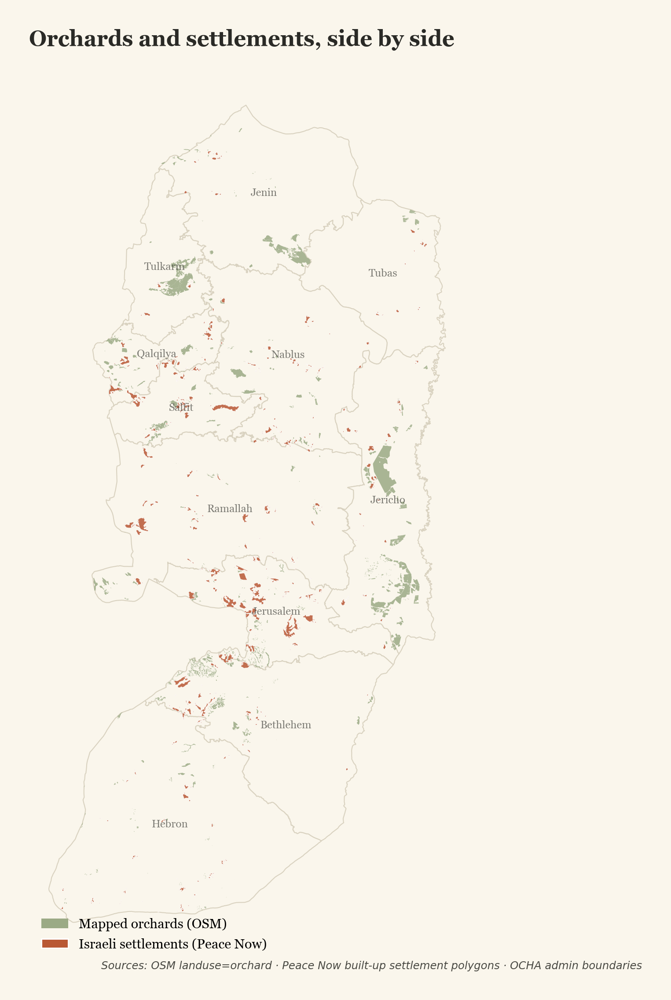{fig-alt="West Bank map showing orchards in sage and settlement footprints in terracotta side by side"}

```{python}
#| echo: false
#| output: asis
n_sett = int(S("total_settlements"))
sett_dunums = int(S("settlement_area_dunums"))
print(f"Peace Now has mapped **{n_sett:,}** built-up settlement footprints in the "
      f"West Bank, totaling roughly **{sett_dunums:,}** dunums of construction. The "
      f"two layers above were drawn from independent sources, but they sit on the "
      "same hillsides. The footprint is dense and concentrated on the central ridges, "
      "the same ridges where olive cultivation has been continuous for centuries.[^settlements-history]")
```

It is not a remote phenomenon visible only from a satellite or a planning document. It is a series of red roofs on hilltops, visible from every village below.

### What the growth looks like from above

The chart at the top of this part shows the population number. The territorial map in Part I shows the spatial layer at the regional scale. Neither, on its own, shows the *change*, what was open ground or low-density caravans on a given hillside one decade and a built settlement with paved access, perimeter fencing, and a road network reaching toward the next ridge in the next. That is something the satellite record can show directly. Four named hillsides, treated one at a time later in this piece, do that work, each with a 2013-versus-2024 pair you can drag a handle across to read the change.

The chart and the map together establish the *what* of the project: a footprint that is dense and accelerating. The next part addresses why this footprint is not only an issue of land. The expansion is enforced, and on the ground that enforcement has a recognisable shape, recognisable actors, and a documented record.

---

## Not just land, also danger

::: {.kicker}
Part III
:::

The international debate about settlements is usually framed in terms of legality. The Fourth Geneva Convention prohibits an occupying power from transferring its civilian population into occupied territory; under that reading, every Israeli settlement built in the West Bank since 1967 is illegal under international law, a position shared by the International Court of Justice, every UN Security Council resolution to address the subject, and the European Union.[^legality] That framing is correct, but it is not, on its own, sufficient. The footprint in the previous part is not enforced primarily through paperwork. It is enforced on the ground, by people, and the people doing the enforcing have names, organisations, and a published doctrine.

### The Hilltop Youth

The most active force behind the post-2000 outpost wave is a loose movement of young religious settlers known as the *Hilltop Youth* (Hebrew: *Noar HaGva'ot*). The movement emerged in the late 1990s as a generational break with the older settler establishment. Where the parents' generation had built core settlements with permits and state planning, the children would seize hilltops without them, and then defend the seizure as a religious obligation. Their stated programme is the redemption of the biblical Land of Israel through physical presence on every available ridge, by force where force is required. Israeli journalists and academics who have spent years inside the movement, including Idith Zertal and Akiva Eldar in *Lords of the Land* and Gadi Taub in *The Settlers*, describe a doctrine that explicitly rejects the authority of the secular Israeli state where that authority would constrain settlement.[^hilltop-youth]

The operational expression of that doctrine is the "price tag" attack: a coordinated assault on a Palestinian village (homes burned, vehicles torched, livestock killed, sometimes a resident killed) staged in retaliation for some perceived injury, almost always by groups of settlers descending from a nearby outpost. The pattern has been documented by B'Tselem, Yesh Din, and the Israeli internal security service Shin Bet, which has at various points designated specific Hilltop Youth networks as terrorist organisations under Israeli law.[^price-tag] The 2024 mass attack on Al-Mughayyir described later in this piece, the 2023 attack on Turmus Ayya, and the chronic pattern of harvest-time arson around Burin all sit inside this category.

After October 2023, the same networks that had carried out smaller incidents before the war began appearing in larger groups, more often, and with greater impunity. UN OCHA recorded a sharp rise in attacks on Palestinian communities in the West Bank in the months after October 7, the highest monthly counts in the agency's twenty-year record of monitoring such incidents.[^ocha-postoct7] Several Hilltop Youth-affiliated figures who had previously faced legal restrictions were quietly released or had their restrictions eased after the war began.[^figures-released]

The current government does not treat this network as an embarrassment to be policed. It treats it as a constituency to be defended. National Security Minister Itamar Ben-Gvir, the cabinet member directly responsible for the Israel Police and the Border Police that operate in the West Bank (and therefore the official whose office would, under any reading of the law, be the apparatus restraining settler attacks on Palestinian villages), used a security cabinet meeting in June 2023 to push back on his own security services for arresting them. He said this:

::: {.pullquote}
"Most of them are sweet boys. Administrative arrests turn people into heroes. I was the subject of an administrative arrest when I was 18. You're turning snot-nosed boys into heroes." Itamar Ben-Gvir, June 27, 2023[^bengvir-sweet-boys]
:::

The administrative arrest he refers to is the only legal tool Israeli law provides for detaining a Jewish settler suspected of violence in the West Bank without trial. Ben-Gvir's office has, since taking it over, narrowed its use sharply. The minister whose job is to restrain this category of attack is on record describing the people carrying it out as children, and acting accordingly.

### What the attacks look like on the ground

The ACLED record at the heart of this piece counts events. It does not show them. The accounts below come from Najwan Simri and Tamer Qaddumi, two Palestinian journalists who have been documenting settler attacks across the West Bank, and from a December 2025 Al Jazeera dispatch on an attack on a herding community. They are a small fragment of what the structured field "civilian-targeting event" contains.

```{=html}
<div class="content-warning">
  <strong>A note before reading.</strong> Some of the videos and photographs linked in this section show settler violence and its aftermath, including assaults on Palestinian civilians, burned land, killed and injured livestock, and a point-blank shooting. The links open in new tabs. They are included as evidence of category and frequency, not for shock; if you would rather not watch, skip past this section.
</div>
```

The clearest single image of what one of these events leaves behind is a grove. The slider below sits over a stretch of agricultural land near Al-Mughayyir before and after a settler arson attack documented by Najwan Simri on the ground. Pull the handle to compare. The "before" frame is the grove as the family that owned it had pruned and harvested it. The "after" frame is the same ground hours later.

```{=html}

  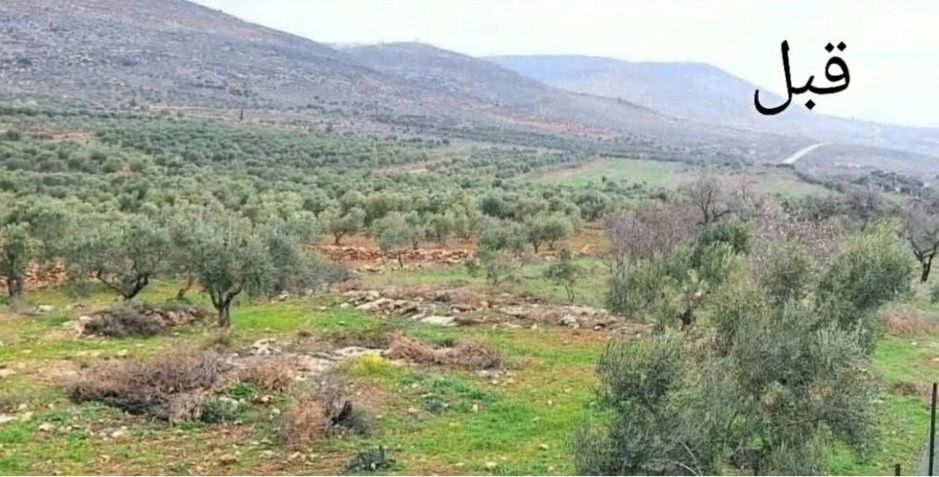
  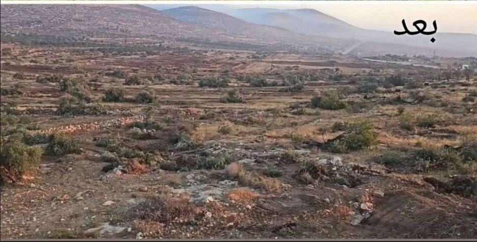
</img-comparison-slider>
<div class="slider-date-labels">
  <span>← Before</span>
  <span>After →</span>
</div>
```

::: {.figure-caption}
Imagery: Najwan Simri (@SimriNajwan), West Bank reporting feed, 2025. A grove on the eastern edge of Al-Mughayyir, photographed before and after a settler arson attack documented on the ground.
:::

```{=html}
<div class="damage-gallery">
  <div class="damage-card">
    <div class="damage-card-meta">December 2025 · Al Jazeera</div>
    <div class="damage-card-title">Settlers injure Palestinians and kill livestock in the occupied West Bank</div>
    <div class="damage-card-body">A herding community in the central West Bank attacked by settlers from a nearby outpost; sheep killed, residents injured. Filed by Al Jazeera's West Bank correspondents.</div>
    <a class="damage-card-link" href="https://www.aljazeera.com/video/newsfeed/2025/12/23/israeli-settlers-injure-palestinians-kill-livestock-in-owb" target="_blank" rel="noopener">Watch the report on Al Jazeera →</a>
  </div>
  <div class="damage-card">
    <div class="damage-card-meta">Najwan Simri (@SimriNajwan) · 2025</div>
    <div class="damage-card-title">Settler attack documented in real time</div>
    <div class="damage-card-body">On-the-ground footage from a settler incursion in the West Bank, with vehicles, structures, and groves affected.</div>
    <a class="damage-card-link" href="https://x.com/SimriNajwan/status/2012628965492404505" target="_blank" rel="noopener">View the post on X →</a>
  </div>
  <div class="damage-card">
    <div class="damage-card-meta">Najwan Simri (@SimriNajwan) · 2025</div>
    <div class="damage-card-title">Attack on a civilian praying on the side of the road</div>
    <div class="damage-card-body">The video in this post shows a settler running over a Palestinian civilian praying on the side of the road.</div>
    <a class="damage-card-link" href="https://x.com/SimriNajwan/status/2004232714195816609" target="_blank" rel="noopener">View the post on X →</a>
  </div>
  <div class="damage-card">
    <div class="damage-card-meta">Najwan Simri (@SimriNajwan) · 2025</div>
    <div class="damage-card-title">Olive grove before and after a settler arson attack</div>
    <div class="damage-card-body">Post showing the before and after of an olive grove near the town of Al-Mughayyir, the same pair shown in the slider above.</div>
    <a class="damage-card-link" href="https://x.com/SimriNajwan/status/1959260157340242118" target="_blank" rel="noopener">View the post on X →</a>
  </div>
  <div class="damage-card">
    <div class="damage-card-meta">Tamer Qaddumi (@tamerqdh) · 2025</div>
    <div class="damage-card-title">Settler assaults a Palestinian woman during the olive harvest</div>
    <div class="damage-card-body">A masked Israeli settler attacks a Palestinian woman picking olives on her family's land in Al-Mughayyir, north of Ramallah. Members of her family are with her at the time.</div>
    <a class="damage-card-link" href="https://x.com/tamerqdh/status/1979864141591617771" target="_blank" rel="noopener">View the post on X →</a>
  </div>
  <div class="damage-card">
    <div class="damage-card-meta">Tamer Qaddumi (@tamerqdh) · 2025</div>
    <div class="damage-card-title">Assault on a man already missing his foot from a previous settler shooting</div>
    <div class="damage-card-body">Sheikh Saeed, who lost his foot months earlier when a settler shot him, is assaulted again by settlers on his land in Al-Rakeez village near Yatta. The Israeli army then arrests him.</div>
    <a class="damage-card-link" href="https://x.com/tamerqdh/status/1961002470055858613" target="_blank" rel="noopener">View the post on X →</a>
  </div>
  <div class="damage-card">
    <div class="damage-card-meta">Tamer Qaddumi (@tamerqdh) · 2026</div>
    <div class="damage-card-title">Mass settler raid on Jalud village, Nablus governorate</div>
    <div class="damage-card-body">A coordinated raid by settlers on Jalud, a small village in the Nablus governorate. Residents push the first wave back; a much larger group returns shortly after, with the stated objective of displacing residents and seizing homes, land, and livestock.</div>
    <a class="damage-card-link" href="https://x.com/tamerqdh/status/2048781888815325326" target="_blank" rel="noopener">View the post on X →</a>
  </div>
  <div class="damage-card">
    <div class="damage-card-meta">Tamer Qaddumi (@tamerqdh) · 2025</div>
    <div class="damage-card-title">Settler runs a Palestinian shepherd's flock over with a vehicle</div>
    <div class="damage-card-body">An Israeli settler deliberately drives over a herd of sheep belonging to a Palestinian shepherd, in a village east of Ramallah.</div>
    <a class="damage-card-link" href="https://x.com/tamerqdh/status/1901735749608775722" target="_blank" rel="noopener">View the post on X →</a>
  </div>
  <div class="damage-card">
    <div class="damage-card-meta">Tamer Qaddumi (@tamerqdh) · 2024</div>
    <div class="damage-card-title">Point-blank shooting of a Palestinian civilian, soldier present</div>
    <div class="damage-card-body">A video shows a settler shooting an unarmed young Palestinian man in the abdomen at point-blank range, with an Israeli soldier standing next to him who does not intervene. According to army sources, the suspected shooter was interrogated for twenty minutes and then released.</div>
    <a class="damage-card-link" href="https://x.com/tamerqdh/status/1864004582637994361" target="_blank" rel="noopener">View the post on X →</a>
  </div>
</div>
```

None of this is irregular. The posts above are a small set of incidents that happened to reach a camera. The pattern they fit into is a near-daily occurrence in the central and northern West Bank, and the human-rights monitors that track it (UN OCHA, B'Tselem, Yesh Din) all describe their documented case files as a floor on what actually happens, not a count. Most attacks of this category never reach a microphone, a journalist's feed, or a UN bulletin. They are absorbed by the village they happened to, by the family whose tree was burned or whose father was beaten, and they sit outside every record this piece can show. The structured ACLED data the analysis below is built on sits on top of that same uncounted pile.

::: {.figure-caption}
Source links open in a new tab. Material referenced is journalistic reporting and on-the-ground footage; quoted only as evidence of category and frequency, not as primary data for the analysis in the next part.
:::

The next part returns to the structured record and asks the geographical question that follows from this one: where, on the West Bank map, does this kind of attack actually concentrate? The answer is not "everywhere settlement is dense." It is "everywhere a settlement is physically *near* a village."

---

## How close it has come

::: {.kicker}
Part IV
:::

The settlement layer is a static footprint. Civilian-targeting events are how that footprint is enforced day to day. The pattern below is what happens when the line on the previous chart keeps climbing.

### The climb

```{python}
#| echo: false
#| output: asis
total = S("total_civilian_targeting_events")
first = S("first_year"); last = S("last_year")
print(f"Between **{first} and {last}**, ACLED records **{int(total):,}** "
      f"civilian-targeting events in the West Bank. Two-thirds of them fall in "
      "the last three years of the series.")
```

```{=html}
<div class="interactive-embed">
  <iframe src="interactive/annual_targeting_harvest.html"
          style="width:100%; min-height:540px; border:none;"
          loading="lazy"
          title="Interactive stacked bar of annual civilian-targeting events with harvest split"></iframe>
</div>
```

::: {.figure-caption}
Annual civilian-targeting events in the West Bank, 2016–2026, with the October to November olive-harvest portion broken out in terracotta. Hover any bar for the exact split. ACLED monthly aggregates via HDX.
:::

The series does not climb evenly. From 2016 through 2020 the annual count sits in a narrow band. 2021 is the first break in the pattern. 2023 is the second, and the larger one. The count in that single year exceeds the totals of 2016, 2017, and 2018 combined. The harvest-season slice in terracotta is present in every bar, but it widens as the total widens.

The shape of the climb maps onto the slope of the population chart in Part II. The same period when settlement growth accelerated also produced the largest increases in documented attacks.

The heatmap below disaggregates the same record by governorate. The dark vertical band across 2023 to 2025 is visible in every row. The climb is a West-Bank-wide phenomenon.

```{=html}
<div class="interactive-embed">
  <iframe src="interactive/heatmap.html"
          style="width:100%; min-height:560px; border:none;"
          loading="lazy"
          title="Heatmap of civilian-targeting events by governorate and year"></iframe>
</div>
```

::: {.figure-caption}
Hover any cell for the governorate-year count. Governorates are ordered by cumulative events.
:::

### Proximity

The strongest finding in the dataset is not the climb. It is the *distance*. For each civilian-targeting event with valid coordinates, the distance from the event location to the nearest Peace Now-mapped settlement:

```{=html}
<div class="interactive-embed">
  <iframe src="interactive/settlement_proximity.html"
          style="width:100%; min-height:540px; border:none;"
          loading="lazy"
          title="Interactive histogram of distances from each event to nearest settlement"></iframe>
</div>
```

::: {.figure-caption}
For each of the 13,749 events targeting Palestinian civilians with valid coordinates, the distance to the nearest Peace Now settlement boundary. Hover any bar for the bin's exact event count; the dashed terracotta line marks the median. Distances in Israeli Transverse Mercator (EPSG:2039).
:::

```{python}
#| echo: false
#| output: asis
within_2 = S("events_within_2km_pct")
within_5 = S("events_within_5km_pct")
median = S("event_settlement_distance_median_km")
print(f"The median distance from an event to the nearest settlement is "
      f"**{median} km**. **{within_2}%** of events fall within 2 km of a "
      f"settlement; **{within_5}%** within 5 km. Friction is a *point-level* "
      "phenomenon. It concentrates where settlements and Palestinian villages "
      "are physically nearest to one another.")
```

The same pattern is visible, though more coarsely, at the governorate scale:

```{=html}
<div class="interactive-embed">
  <iframe src="interactive/settlements_vs_events.html"
          style="width:100%; min-height:620px; border:none;"
          loading="lazy"
          title="Interactive scatter of settlements per governorate vs civilian-targeting events"></iframe>
</div>
```

::: {.figure-caption}
Settlements per governorate vs civilian-targeting events 2016–2026. Hover any point for the governorate's exact counts. Sources: Peace Now built-up settlements (HDX) · ACLED monthly aggregates.
:::

```{python}
#| echo: false
#| output: asis
r_val = S("settlements_events_pearson_r")
print(f"The governorate-level correlation is moderate-to-strong "
      f"(Pearson **r = {r_val}**). Ramallah, Hebron, Nablus, and Jerusalem are "
      "the four governorates with the highest settlement counts, and they are "
      "also the four with the highest civilian-targeting event counts. The "
      "relationship is real at the polygon scale, but it is much sharper at the "
      "point scale. The median event-to-settlement distance of 1.5 km is closer "
      "than any single governorate's average diameter, which is why the proximity "
      "histogram concentrates so tightly under 2 km.")
```

A small bump near 4 to 4.5 km in the proximity histogram is mostly events in and around East Jerusalem, where the Peace Now layer does not exhaustively map East Jerusalem settlements. This is discussed in the appendix.

### The grove and the attack rate

The settlement layer explains where attacks cluster, but it is only half of the picture this piece is built on. The other half is the grove. The chart below ranks the eleven West Bank governorates by mapped orchard area, in dunums, drawn from the OpenStreetMap `landuse=orchard` polygons used elsewhere in the piece.

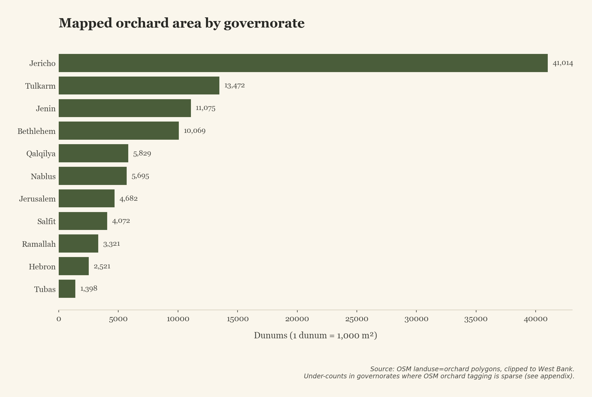{fig-alt="Horizontal bar chart of orchard area in dunums by West Bank governorate, with Jericho at the top"}

The relationship between orchard area and the attack count is not a straight line, and the gap is the point. Jericho carries the most mapped orchard area in the West Bank, by a wide margin, and among the fewest civilian-targeting events. Nablus and Hebron carry far less mapped orchard area than Jericho, and the most events. The reason is geographic. Jericho's orchards sit in the Jordan Valley, separated from the central ridge where the settler movement has concentrated for fifty years. Nablus and Hebron's orchards sit on the same ridges as the settlements. The trees in danger are not the largest groves. They are the groves on the same hillsides as the settler outposts, which the four villages later in this piece visit one at a time.

The interactive map below lets you compare the per-governorate event timelines directly. Click any of the eleven dots to swap the chart on the right to that governorate's annual civilian-targeting count.

```{=html}
<div class="interactive-embed">
  <iframe src="interactive/linked-view.html"
          style="width:100%; min-height:600px; border:none;"
          loading="lazy"
          title="Linked view: click a West Bank governorate on the map to update the annual events chart on the right"></iframe>
</div>
```

::: {.figure-caption}
Linked view: click any governorate centroid on the left panel to update the time series on the right. The size of each marker scales to the governorate's cumulative civilian-targeting event count, 2016 to 2026. Sources: ACLED via HDX, OCHA admin level 2 boundaries.
:::

### Who and what

Two further breakdowns give shape to the friction.

```{python}
#| echo: false
#| output: asis
n_pal = int(S("events_targeting_pal_civilians"))
n_state = int(S("events_perp_state_forces"))
n_settler = int(S("events_perp_settlers"))
print(f"ACLED records **{n_pal:,}** events between 2016 and 2025 in which "
      f"Palestinian civilians are the target. The actor field separates "
      f"perpetrators into recognisable groups: **{n_state:,}** attributed to "
      f"Israeli state forces (military and police), **{n_settler:,}** to "
      "settlers, with the remainder distributed across other Israeli civilians, "
      "unidentified groups, and a small number involving Palestinian actors.")
```

```{=html}
<div class="interactive-embed">
  <iframe src="interactive/perpetrator_breakdown.html"
          style="width:100%; min-height:560px; border:none;"
          loading="lazy"
          title="Interactive stacked bar of events targeting Palestinian civilians by perpetrator"></iframe>
</div>
```

::: {.figure-caption}
Annual events targeting Palestinian civilians, stacked by perpetrator. The settler share grows faster in proportional terms after 2021 than the state-force share. Hover any band for the year's exact perpetrator split.
:::

The "Other Israeli (civilians, unidentified)" bar is worth flagging. ACLED only labels an actor as "Settlers" when the source reporting explicitly identifies them as such. When a press report says "Israeli civilians attacked the village" without using the word *settler*, or when the reporter could not confirm a settler affiliation, the event lands in this residual bucket. In practice many of these events follow the same geographic pattern as the named-settler events, but the conservative classification means the "Settlers" band undercounts and the "Other Israeli" band absorbs the gap.

```{=html}
<div class="interactive-embed">
  <iframe src="interactive/fatalities_by_event_type.html"
          style="width:100%; min-height:540px; border:none;"
          loading="lazy"
          title="Interactive stacked-area chart of West Bank fatalities by event type"></iframe>
</div>
```

::: {.figure-caption}
Recorded West Bank fatalities, 2016–2026, split by ACLED event type. The terracotta civilian-targeting band was a quiet sliver before 2021. Hover any year for the band-by-band fatalities split.
:::

ACLED splits West Bank events into broad event-type buckets. *Civilian targeting* covers attacks on Palestinians who are not active combatants: homes torched, individuals assaulted, vehicles burned, livestock killed, the kinds of events the rest of this piece focuses on. *Political violence* covers what ACLED's codebook calls "Battles" and "Explosions/Remote violence", military raids, exchanges of fire, airstrikes, and IEDs. The terracotta band is the slice of West Bank fatalities that ACLED specifically codes as the targeting of civilians.

The label *political violence* needs a caveat. In the West Bank context it carries a misleading symmetry. ACLED's "Battle" sub-event type is defined as a violent interaction between two organised armed groups, but the rule its coders apply on the ground is responsive: once Israeli forces use live ammunition against a Palestinian crowd, the crowd is treated as an "armed group" for classification purposes, even when its weapons are stones.[^acled-battles] Many fatalities recorded as Battles in this dataset are Palestinians, often youth, killed during stone-throwing confrontations near Israeli military checkpoints, settler bypass roads, or village entrances. ACLED's third bucket, *Demonstrations* (Protests and Riots), would in principle carry these incidents, but it records zero fatalities in our period because once live fire enters the picture ACLED re-codes the event from a Riot to a Battle. Read the political-violence band as "fatalities in confrontations involving Israeli forces", not as "casualties of two-sided armed combat".

```{python}
#| echo: false
#| output: asis
fatal = int(S("total_fatalities"))
print(f"ACLED documents **{fatal:,}** fatalities in civilian-targeting events alone. "
      "Until 2020 the annual count was in the low double digits. From 2023 onward "
      "it climbs by an order of magnitude.")
```

The structured fields end at perpetrator and fatality count. The texture of what was actually targeted lives in the free-text `notes` field. A simple keyword scan over those narratives produces a rough but informative inventory:

```{=html}
<div class="interactive-embed">
  <iframe src="interactive/damage_breakdown.html"
          style="width:100%; min-height:520px; border:none;"
          loading="lazy"
          title="Interactive horizontal bar of damage-type keywords"></iframe>
</div>
```

::: {.figure-caption}
Counts of civilian-targeting events whose narratives mention each keyword. Categories overlap; a single event may damage trees and a vehicle and a house. Hover any bar for the exact count. Matches are indicative, not exhaustive.
:::

```{python}
#| echo: false
#| output: asis
olive = int(S("events_mention_olive_or_tree"))
livestock = int(S("events_mention_livestock"))
print(f"**{olive:,}** events mention olive trees or groves in their narrative. "
      f"**{livestock:,}** mention livestock (sheep, goats, or cattle). These are "
      "floors, not ceilings. An attack that damages a grove without using the "
      "word 'olive' will not be tagged here. The figures should be read as "
      "evidence that the targeting reaches the agricultural and economic life of "
      "the village, not as a definitive accounting of damage.[^livestock-source]")
```

Most events sit in the central and northern governorates, the same governorates where settlement footprint is densest, where outposts have proliferated since 2010, and where the next part of this piece picks four hillsides to look at one at a time.

---

## Four hillsides

::: {.kicker}
Part V
:::

What the records produce in aggregate is a number. What it is to live inside that number is something the aggregate does not show. Four villages, north to south, across three governorates, make the same record visible at the hillside scale. In each case the satellite pair below the prose shows the *adjacent settlement or outpost* over time, not the village itself. What the trees were watching is the construction across the ridge.

The locator on the left tracks where you are. As you scroll into each village, its dot lights up.

::: {#villages-scrolly .scrolly-section}
::: {.scrolly-grid}
::: {#villages-locator-frame .scrolly-graphic}

```{python}
#| echo: false
#| output: asis
import re
from pathlib import Path
_svg = Path("assets/villages_locator.svg").read_text(encoding="utf-8")
_svg = re.sub(r"<\?xml[^?]*\?>\s*", "", _svg)
_svg = re.sub(r"<!DOCTYPE[^>]*>\s*", "", _svg)
print(_svg)
```

:::

::: {.scrolly-prose}

::: {.scrolly-step data-step="burin"}
### Burin · Nablus governorate

Burin sits at the southern edge of Nablus, in the bowl of a valley overlooked on three sides by hills. On those hills are the settlements of Bracha and Yitzhar and a string of outposts (Givat Ronen, Giv'at Arousi, and others) which have been the documented source of repeated harvest-time attacks for two decades.[^burin-source] The pattern, recorded year after year by B'Tselem, the United Nations, and the Israeli press, is consistent. Settlers descend the hill during the October harvest, set fire to groves below, and either chase pickers out or stand between farmers and their trees. In a single recent year, monitors documented dozens of separate incidents in and around Burin involving Palestinian farmers being prevented from accessing their land, or trees uprooted or burned.[^btselem-burin]

The village's olive grove climbs the slope toward the settlements. A farmer's tree and a settler outpost can be a few hundred metres apart on foot. The earlier finding in this piece, a median 1.5 km between events and the nearest settlement, collapses in Burin to walking distance.

```{=html}

  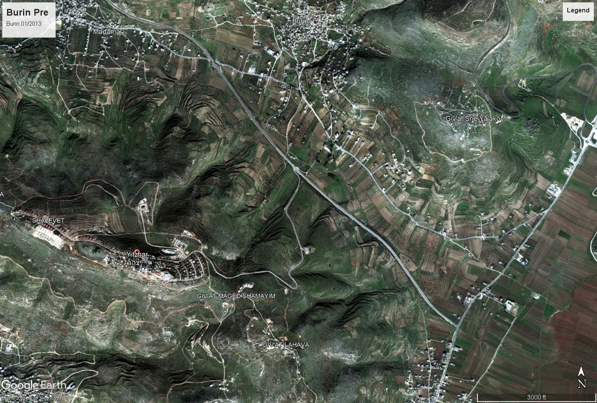
  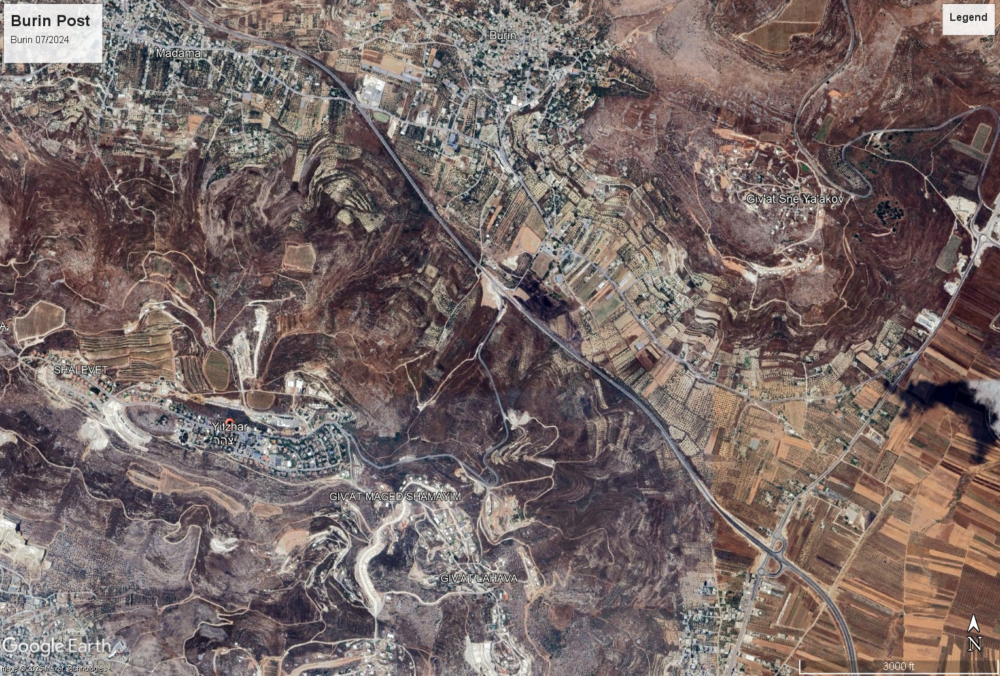
</img-comparison-slider>
<div class="slider-date-labels">
  <span>← January 2013</span>
  <span>September 2024 →</span>
</div>
```

::: {.figure-caption}
The hills southwest of Burin (left of frame) carry the settlement of Yitzhar at the top of the ridge and the outposts of Givat Ronen, Shalhevet Yitzhar, and Hill 725 along the slopes that face the village. In the 2013 scene the outposts are scattered clusters of caravans set back from the ridge edge; by 2024 they are continuous built-up rows reaching down toward Burin's groves, joined by new graded access roads, and the wooded ground that separated them from the village in 2013 has visibly thinned. *Imagery: Google Earth Pro historical archive, captures dated January 2013 and September 2024.*
:::

:::

::: {.scrolly-step data-step="turmus"}
### Turmus Ayya · Ramallah governorate (north)

Turmus Ayya is unusual among West Bank villages. Roughly two-thirds of its population, historically estimated at around 3,500 permanent residents, are Palestinian-Americans, many of whom return each summer to the village their families come from. Its olive groves stretch for kilometres on hillsides that abut the settlement of Shilo and the larger settlement of Eli to the south, with a string of outposts on the intervening ridges.[^turmus-source]

In June 2023, a settler attack on Turmus Ayya killed a Palestinian-American resident and burned approximately thirty homes and over a hundred vehicles. The incident drew a statement from the United States State Department and was covered widely in Israeli and international press.[^turmus-2023] Subsequent harvests, in October of that year and the years that followed, produced further documented incidents in the village's groves. Turmus Ayya is, in that sense, a place where the climbing line in the annual chart and the dot on the proximity histogram have a single, reported, named day.

```{=html}

  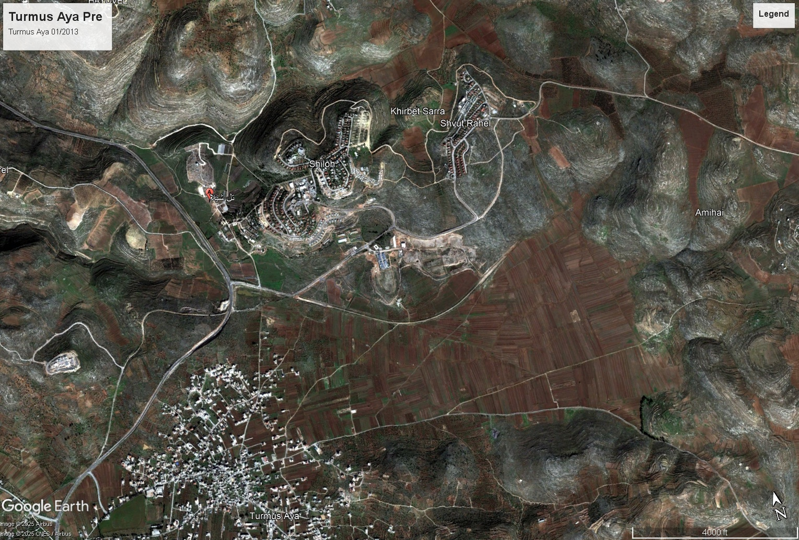
  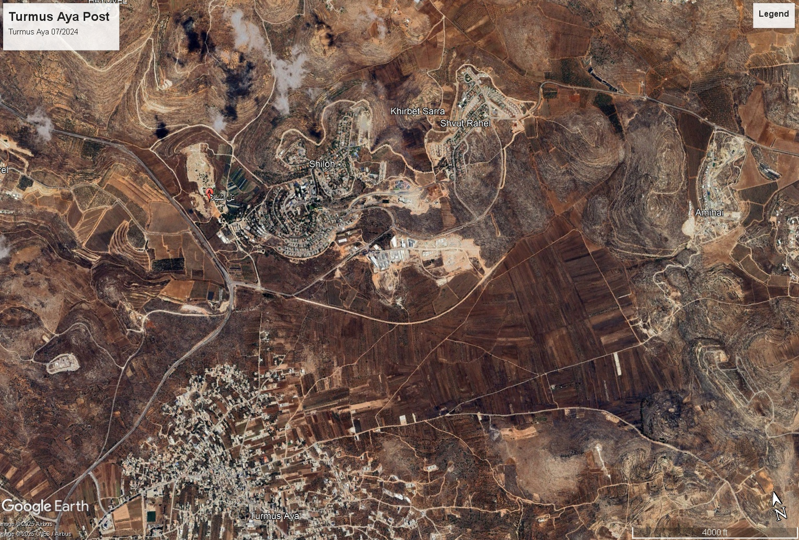
</img-comparison-slider>
<div class="slider-date-labels">
  <span>← January 2013</span>
  <span>July 2024 →</span>
</div>
```

::: {.figure-caption}
Turmus Ayya is the dense built-up village in the lower (southern) portion of the frame, with its grid of homes and the bands of olive groves climbing the slopes around it. The two settlements with the precise planned-grid layout in the upper (northern) portion of the frame are Shilo (the larger built-up block) and Shvut Rachel; smaller outposts sit on the intervening hilltops between them and Turmus Ayya. Between 2013 and 2024 Shilo's perimeter pushes south toward the village's groves, Shvut Rachel roughly doubles in built-up extent, and at least two previously bare hilltops in between carry new clusters of structures and access tracks. *Imagery: Google Earth Pro historical archive, captures dated January 2013 and July 2024.*
:::

:::

::: {.scrolly-step data-step="mughayyir"}
### Al-Mughayyir · Ramallah governorate (east)

Al-Mughayyir is a Palestinian village of roughly 3,000 residents on the eastern slopes of the Ramallah governorate, looking out over the Jordan Valley. The village sits in the middle of a cluster of settlements and unauthorized outposts (Adei Ad, Esh Kodesh, Ahiya, Geulat Tzion among them) that have grown rapidly since 2010 and accelerated again after October 2023.[^mughayyir-source]

In April 2024, following the disappearance of an Israeli teenager nearby, hundreds of settlers from the surrounding outposts entered Al-Mughayyir and the adjacent villages over several days, burning homes and vehicles, shooting livestock, and killing one resident. The incident was one of the largest single-day settler attacks recorded in the West Bank since the second Intifada, and was documented by B'Tselem, Yesh Din, the United Nations, and Israeli and international press.[^mughayyir-2024] The proximity story this piece develops elsewhere, that friction concentrates where settlements and Palestinian villages are physically nearest, is in Al-Mughayyir more or less the entire geography of the village.

```{=html}

  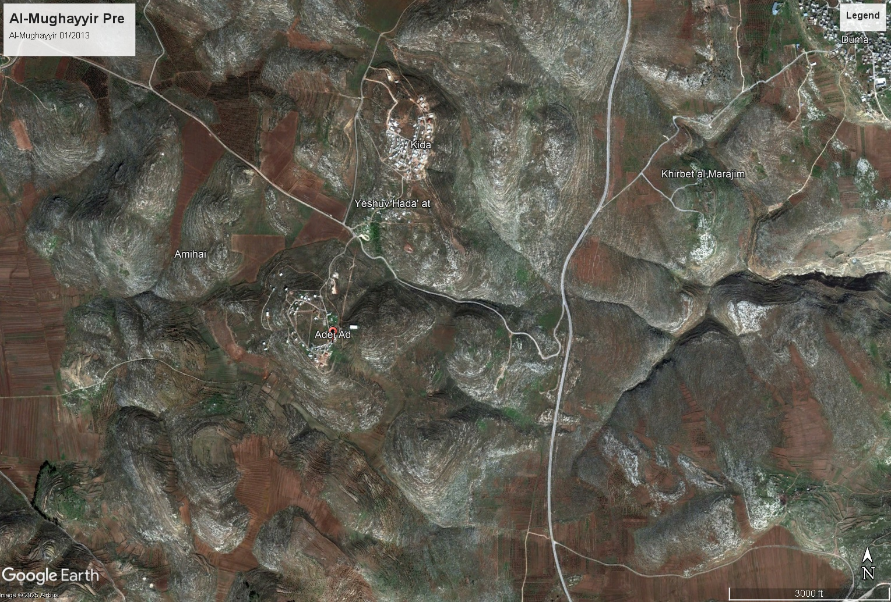
  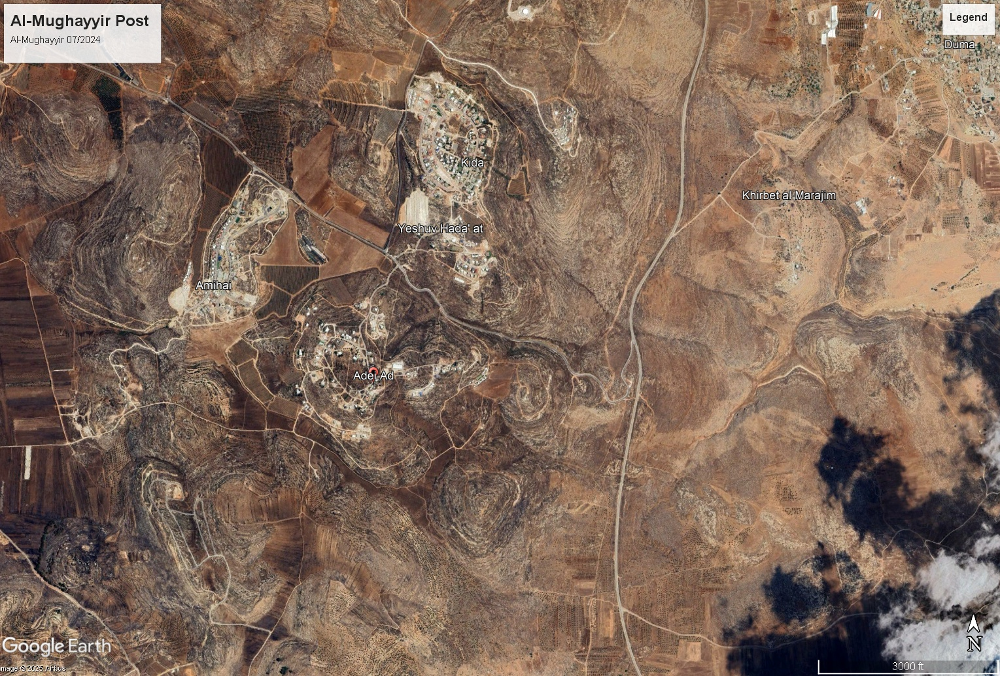
</img-comparison-slider>
<div class="slider-date-labels">
  <span>← January 2013</span>
  <span>July 2024 →</span>
</div>
```

::: {.figure-caption}
Al-Mughayyir village itself sits just north of this frame; what you see here is the cluster of settlements and unauthorized outposts directly south and east of it, on the hill country that drops toward the Jordan Valley. Visible across the frame are the outposts of Amihai (upper-left), Adei Ad (centre-left), Yeshuv Hada'at (centre), and others further east. The change between 2013 and 2024 is the most dramatic of the four villages: hilltops that in 2013 were either empty or held a handful of caravans now carry continuous settlement footprints, the outposts are joined by a graded road network that did not exist in the earlier image, and the agricultural terraces in the foreground are visibly more interrupted by tracks and clearings. *Imagery: Google Earth Pro historical archive, captures dated January 2013 and July 2024.*
:::

:::

::: {.scrolly-step data-step="tuwani"}
### At-Tuwani · South Hebron Hills

At-Tuwani is a small Palestinian village in the South Hebron Hills, immediately adjacent to the Israeli settlement of Ma'on and the outpost of Havat Ma'on. For more than two decades, international observer organisations (Operation Dove and Christian Peacemaker Teams among them) have stationed accompaniers in the village to escort children walking to school past the outpost, an arrangement made necessary by repeated documented attacks on schoolchildren and harvesters.[^tuwani-source]

The olive grove at At-Tuwani is small, but it is among the most thoroughly documented olive groves in the West Bank. Yesh Din, B'Tselem, and the Israeli press have catalogued harvest-time incidents in the same orchards, by the same actors from the same outpost, for nearly twenty consecutive years. The continuity is part of what makes the change in the area readable from above. Where Havat Ma'on once held a handful of caravans on a hilltop, the outpost now spreads down the slopes toward the village.

```{=html}

  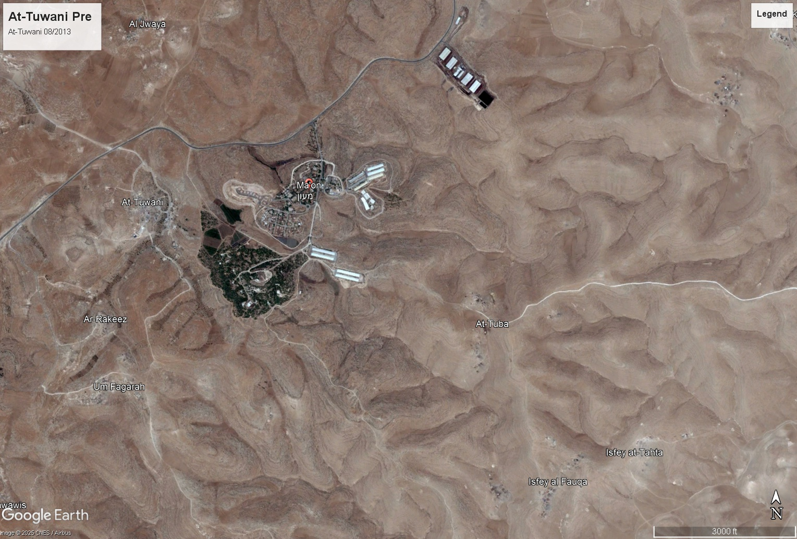
  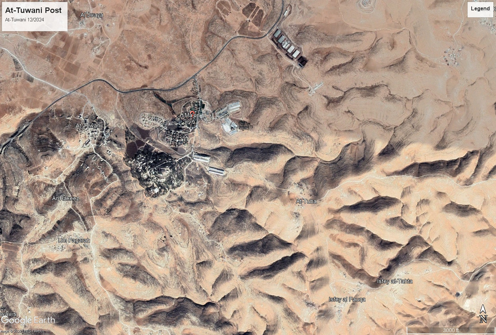
</img-comparison-slider>
<div class="slider-date-labels">
  <span>← September 2013</span>
  <span>December 2024 →</span>
</div>
```

::: {.figure-caption}
At-Tuwani is the small village on the left (western) side of the frame. The planted settlement of Ma'on sits to the east (right) on its ridge, and the unauthorized outpost of Havat Ma'on occupies the hilltop in between, the same hilltop the village's children walk past on the way to school. In 2013 Havat Ma'on is a tight cluster of perhaps a dozen structures inside a ring of trees; by 2024 the cluster has more than doubled, the planted woodland has been cut back along its edges, and new structures and tracks reach toward the path Operazione Colomba accompaniers have been escorting children along for two decades. *Imagery: Google Earth Pro historical archive, captures dated September 2013 and December 2024.*
:::

:::

:::
:::
:::

```{=html}
<script>
(function() {
  const SLUGS = ["burin", "turmus", "mughayyir", "tuwani"];

  function init() {
    if (typeof scrollama === "undefined") {
      window.addEventListener("load", init, { once: true });
      return;
    }
    const graphic = document.getElementById("villages-locator-frame");
    if (!graphic) return;

    const scroller = scrollama();
    scroller
      .setup({
        step: "#villages-scrolly .scrolly-step",
        offset: 0.55,
        debug: false,
      })
      .onStepEnter(({ element }) => {
        const slug = element.dataset.step;
        if (!SLUGS.includes(slug)) return;
        SLUGS.forEach((s) => graphic.classList.remove("is-active-" + s));
        graphic.classList.add("is-active-" + slug);
        graphic.classList.add("is-scrolly-active");
      });
    window.addEventListener("resize", () => scroller.resize());
  }

  if (document.readyState === "loading") {
    document.addEventListener("DOMContentLoaded", init);
  } else {
    init();
  }
})();

// Click-to-expand for the village before/after sliders. Each slider gets a
// small "Expand" button; clicking it opens a fullscreen modal containing a
// clone of the slider with +/-/100%/Close buttons. Zoom enlarges the slider
// past the modal viewport so the reader can scroll/drag to pan, while the
// slider's own divider drag continues to work because its pointer
// coordinates are computed relative to its element bounds, not the page.
(function() {
  const ZOOM_STEP = 1.35;
  const ZOOM_MIN = 1.0;
  const ZOOM_MAX = 5.0;

  function ready(fn) {
    if (document.readyState === "loading") {
      document.addEventListener("DOMContentLoaded", fn);
    } else {
      fn();
    }
  }

  ready(() => {
    document.querySelectorAll(".village-slider").forEach(addExpandButton);
  });

  function addExpandButton(slider) {
    if (slider.closest(".village-slider-overlay")) return;
    if (slider.parentNode && slider.parentNode.classList.contains("village-slider-wrap")) return;
    // Sliders with data-no-expand opt out of the fullscreen modal. Used for
    // the burn before/after in Part III where the imagery is graphic enough
    // that we do not want to invite a closer look.
    if (slider.dataset && slider.dataset.noExpand === "true") return;

    // Wrap the slider in a div, then add the button as a sibling. The button
    // cannot live inside `` because that custom
    // element absorbs unattributed children into its default (handle) slot.
    const wrap = document.createElement("div");
    wrap.className = "village-slider-wrap";
    slider.parentNode.insertBefore(wrap, slider);
    wrap.appendChild(slider);

    const btn = document.createElement("button");
    btn.className = "expand-btn";
    btn.type = "button";
    btn.title = "Open in fullscreen with zoom";
    btn.textContent = "⛶ Expand";
    btn.addEventListener("click", (e) => {
      e.preventDefault();
      e.stopPropagation();
      openOverlay(slider);
    });
    wrap.appendChild(btn);
  }

  function openOverlay(originalSlider) {
    const overlay = document.createElement("div");
    overlay.className = "village-slider-overlay";

    const stage = document.createElement("div");
    stage.className = "overlay-stage";

    const cloned = originalSlider.cloneNode(true);

    const controls = document.createElement("div");
    controls.className = "overlay-controls";
    controls.innerHTML = [
      '<button data-action="zoom-out" title="Zoom out">−</button>',
      '<button data-action="zoom-reset" title="Reset zoom">100%</button>',
      '<button data-action="zoom-in" title="Zoom in">+</button>',
      '<button data-action="close" title="Close (Esc)">✕ Close</button>',
    ].join("");

    const caption = document.createElement("div");
    caption.className = "overlay-caption";
    caption.textContent = "Drag the divider to compare. Scroll or drag to pan when zoomed in. Esc to close.";

    stage.appendChild(cloned);
    overlay.appendChild(stage);
    overlay.appendChild(controls);
    overlay.appendChild(caption);
    document.body.appendChild(overlay);
    document.body.style.overflow = "hidden";

    // The slider's aspect ratio matches its source imagery (1529 x 1035 ≈ 1.477).
    const ASPECT = 1529 / 1035;

    let zoom = 1.0;
    function applyZoom() {
      // Compute the largest slider that fits 95% of viewport width and
      // 85% of viewport height while keeping the source aspect ratio.
      const availW = 0.95 * window.innerWidth;
      const availH = 0.85 * window.innerHeight;
      let baseW, baseH;
      if (availW / availH > ASPECT) {
        baseH = availH;
        baseW = baseH * ASPECT;
      } else {
        baseW = availW;
        baseH = baseW / ASPECT;
      }
      // Setting width/height as inline pixel values (instead of via CSS
      // variables) makes the layout engine fire a real resize event on
      // the slider host, which triggers img-comparison-slider's internal
      // ResizeObserver and keeps both slotted images in sync.
      cloned.style.width = (baseW * zoom) + "px";
      cloned.style.height = (baseH * zoom) + "px";
    }
    function setZoom(z) {
      zoom = Math.max(ZOOM_MIN, Math.min(ZOOM_MAX, z));
      applyZoom();
    }
    // Initial sizing and re-sizing when the viewport changes.
    applyZoom();
    const onResize = () => applyZoom();
    window.addEventListener("resize", onResize);

    controls.addEventListener("click", (e) => {
      const action = e.target.dataset.action;
      if (action === "zoom-in")    setZoom(zoom * ZOOM_STEP);
      else if (action === "zoom-out")  setZoom(zoom / ZOOM_STEP);
      else if (action === "zoom-reset") setZoom(1.0);
      else if (action === "close")     close();
    });

    function close() {
      overlay.remove();
      document.body.style.overflow = "";
      document.removeEventListener("keydown", onKey);
      window.removeEventListener("resize", onResize);
    }

    function onKey(e) {
      if (e.key === "Escape")           close();
      else if (e.key === "+" || e.key === "=") setZoom(zoom * ZOOM_STEP);
      else if (e.key === "-")            setZoom(zoom / ZOOM_STEP);
      else if (e.key === "0")            setZoom(1.0);
    }
    document.addEventListener("keydown", onKey);

    // Click on the dimmed area (not on the slider or controls) closes the
    // overlay. We attach to the overlay element and check whether the click
    // landed on the slider itself.
    overlay.addEventListener("click", (e) => {
      if (e.target === overlay || e.target === stage) close();
    });
  }
})();
</script>
```

---

## What the trees saw

::: {.kicker}
Part VI
:::

The olive tree is not a metaphor for memory. It is the way the memory is kept. A grove handed down through generations is, materially, the same grove. The tree your great-grandfather pruned is the tree your son climbs. That continuity, physical, unbroken, on the same hillside, is what makes the changes documented in this piece visible at all. Without the tree's age, there is no "before."

What the records say, when read together, is direct enough. The Israeli settler population in the West Bank has grown more than six hundred and sixty times over since 1972, with most of the growth arriving after the 1993 agreement that nominally gave Palestinians a path to a state of their own. The footprint of that expansion sits on the central ridges, dense and contiguous, with a built-up area now in the hundreds of millions of square metres. The violence that monitors have catalogued, fifteen thousand civilian-targeting events over a decade, two-thirds of them in the last three years, tracks the settlement footprint both coarsely and finely. Governorates with more settlements record more attacks, and *within* those governorates, attacks cluster sharply on the hillsides where settlements and Palestinian villages are physically nearest to one another. The median event-to-settlement distance is one and a half kilometres. Two-thirds of the events fall within a half-hour walk of the nearest hilltop construction.

That is what the aggregates say. What the four hillsides in the previous part show is that the aggregates have an address, and a name, and a tree.

I have been thinking about a project like this since October 2023, the same month that absorbed the world's attention. I waited until I felt I had the skills and the data fluency to do the case justice, and then I built it. The cameras went somewhere else. The trees, slower than cameras and older than states, kept watching.

::: {.section-ornament}
:::

## By the numbers

```{=html}
<div class="infographic-grid">
```

```{python}
#| echo: false
#| output: asis

def cell(value, label):
    print(
        f'<div class="infographic-cell">'
        f'<div class="bigstat">{value}</div>'
        f'<div class="bigstat-label">{label}</div>'
        f'</div>'
    )

pop_last_yr  = int(S("settler_pop_last_year"))
pop_last_wb  = int(S("settler_pop_last_wb"))
pop_first_yr = int(S("settler_pop_first_year"))
pop_first_wb = int(S("settler_pop_first_wb"))
pop_mult     = S("settler_pop_growth_multiple")
pop_since_oslo = int(S("settler_pop_added_since_oslo"))
combined_yr  = int(S("settler_pop_last_combined_year"))
combined     = int(S("settler_pop_last_combined"))

settlements_n = int(S("total_settlements"))
sett_dunums   = int(S("settlement_area_dunums"))
orchards = int(S("mapped_orchard_polygons"))
dunums   = int(S("mapped_orchard_area_dunums"))

total = int(S("total_civilian_targeting_events"))
fatal = int(S("total_fatalities"))
harvest_pct = S("harvest_season_event_share_pct")

cell(f"{pop_last_wb/1000:.0f}k", f"Israeli settlers in the West Bank ({pop_last_yr})")
cell(f"{pop_mult}×",            f"Growth since {pop_first_yr} ({pop_first_wb:,} → {pop_last_wb:,})")
cell(f"+{pop_since_oslo/1000:.0f}k", "Added since Oslo I (1993)")
cell(f"{combined/1000:.0f}k",   f"Settlers incl. East Jerusalem ({combined_yr})")
cell(f"{settlements_n:,}",      "Built-up settlement footprints mapped (Peace Now)")
cell(f"{sett_dunums/1000:.0f}k", "Dunums of built-up settlement footprint")
cell(f"{S('events_within_2km_pct')}%", "Civilian-targeting events within 2 km of a settlement")
cell(f"{total:,}",       f"Civilian-targeting events, {S('first_year')}–{S('last_year')}")
cell(f"{harvest_pct}%",  "Share of events in the olive-harvest window (Oct–Nov)")
```

```{=html}
</div>
```

Data sources are summarized in the [technical appendix](appendix.qmd).

---

## Notes & sources

[^darwish]: The line is widely attributed to Mahmoud Darwish in Palestinian oral and printed tradition. For Darwish's olive-tree poetry in English, see *Memory for Forgetfulness: August, Beirut, 1982* (University of California Press, 1995) and *Unfortunately, It Was Paradise: Selected Poems* (UC Press, 2003).

[^settler-ideology]: For the institutional history of the settler movement and its religious-nationalist intellectual core, see Idith Zertal and Akiva Eldar, *Lords of the Land: The War over Israel's Settlements in the Occupied Territories, 1967–2007* (Nation Books, 2007); and Gershom Gorenberg, *The Accidental Empire: Israel and the Birth of the Settlements, 1967–1977* (Times Books, 2006).

[^btselem-violence]: B'Tselem documents settler violence and the dispossession pattern in its annual reports (btselem.org/topic/settler_violence). See also UN OCHA's monthly *Protection of Civilians* bulletin and Yesh Din's "Standing Idly By" series on Israeli law-enforcement response.

[^olive-history]: Frankel, R., *Wine and Oil Production in Antiquity in Israel and Other Mediterranean Countries* (Sheffield Academic Press, 1999); on Roman-era olive presses and the long cultivation history of the region.

[^yield]: Per-tree yield ranges for rain-fed Palestinian olive cultivation are reported by the Food and Agriculture Organization of the United Nations and the Palestinian Agricultural Relief Committees. Yields vary by year and by tree age; rain-fed groves in the West Bank typically fall in the three to fifteen kilogram range.

[^pcbs-area]: Palestinian Central Bureau of Statistics, agricultural census, olive area as a share of cultivated land in the West Bank.

[^oecd-families]: OECD / FAO estimates on the number of Palestinian families deriving income from the olive grove. Coverage varies by year; the figure cited is the conventional range used by Palestinian and international agricultural reporting.

[^settlements-history]: Settlement layer from Peace Now via HDX (`state-of-palestine-settlements`). For institutional history of West Bank settlement growth, see the United Nations Office for the Coordination of Humanitarian Affairs (OCHA) or the Foundation for Middle East Peace.

[^settler-pop-source]: Annual settler-population figures compiled from Peace Now's *Settlements Watch* population page (peacenow.org.il/en/settlements-watch/settlements-data/population), the Foundation for Middle East Peace *Settlement Report* archive (fmep.org/resource/settlement-report/), and the Israeli Central Bureau of Statistics *Statistical Abstract of Israel*, "Localities and Population." The 2025 West Bank figure (529,704) is from the CBS Population Registry release of early 2026, also reproduced in Wikipedia's *Population statistics for Israeli settlements in the West Bank* and in the Foundation for Middle East Peace's March 2026 *Settlement and Annexation Report*. Outpost residents (~20,000 to 30,000 in 2023) are excluded from the West Bank figure as Israeli CBS does not count them; East Jerusalem figures are extracted by Peace Now and FMEP from Israeli neighbourhood-level census data and not separately published by CBS as "settlers." Pre-1990 numbers vary by 10 to 20 percent across sources; the values shown follow the Peace Now and CBS retrofit. The 2024 West Bank value (520,000) is Peace Now's preliminary publication; East Jerusalem 2024 has not been separately published.

[^livestock-source]: Livestock and agricultural-property damage are tracked in the violence-monitoring records of B'Tselem (btselem.org) and Yesh Din (yesh-din.org). ACLED's structured fields record events and fatalities; non-fatal damage descriptions appear only in event narratives.

[^acled-battles]: ACLED's *Codebook* (acleddata.com/methodology/acled-codebook) defines a *Battle* as "a violent interaction between two organized armed groups at a particular time and location" and a *Riot* as a "violent event where demonstrators or mobs of three or more engage in violent or destructive acts, including but not limited to physical fights, rock throwing, property destruction, etc." In practice, when Israeli forces respond to a stone-throwing crowd with live ammunition, the resulting fatality is typically coded as a Battle (with the rioting crowd treated as the second "armed group"), not as a Riot fatality. This is why the Demonstrations band in the chart above is empty for the West Bank in this period, and why the Political Violence band absorbs incidents that on the ground are asymmetric, often deadly responses to unarmed or stone-armed Palestinian protesters. UN OCHA's *Protection of Civilians* weekly reports (ochaopt.org/data/casualties) and B'Tselem's *Statistics* section use a different classification that separates these incidents and reports them as killings during demonstrations and clashes with Israeli forces; the gap between the two taxonomies is documented in OCHA's methodology pages.

[^burin-source]: For the long record of harvest-time settler violence around Burin and the surrounding Nablus-area settlements (Bracha, Yitzhar, and outposts including Givat Ronen), see B'Tselem, "Settler Violence = State Violence" reporting (btselem.org/topic/settler_violence) and UN OCHA's *Protection of Civilians* bulletins. Israeli press coverage in *Haaretz* and +972 Magazine has documented the same pattern over multiple harvest seasons.

[^btselem-burin]: B'Tselem and Yesh Din case files on Burin record dozens of separate incidents per year of access denial, tree damage, and physical attack on farmers. See B'Tselem's village-level reporting and Yesh Din's "Standing Idly By" series on Israeli law-enforcement response to settler violence.

[^turmus-source]: For Turmus Ayya's demographic profile and its proximity to Shilo and surrounding outposts, see reporting in *The Washington Post*, *The New York Times*, and Israeli outlets *Haaretz* and *Times of Israel* covering the village in 2023. Population figures from the Palestinian Central Bureau of Statistics.

[^turmus-2023]: The June 2023 attack on Turmus Ayya, including the killing of a US citizen and the burning of homes and vehicles, was reported by the US State Department, the Associated Press, *The Washington Post*, *Haaretz*, and B'Tselem. See also UN OCHA's *Protection of Civilians* bulletin for that reporting period.

[^tuwani-source]: On At-Tuwani and the long-running international accompaniment presence (Operazione Colomba / Operation Dove, and Community Peacemaker Teams, formerly Christian Peacemaker Teams), see operazionecolomba.it and cpt.org. The school-escort arrangement is also documented by B'Tselem and UN OCHA in their South Hebron Hills reporting.

[^mughayyir-source]: For Al-Mughayyir's geography and the cluster of surrounding settlements and outposts (Adei Ad, Esh Kodesh, Ahiya, Geulat Tzion), see B'Tselem (btselem.org) and Yesh Din (yesh-din.org) outpost-tracking reports, as well as Peace Now's "Settlement Watch" outpost map. The accelerated outpost growth in the area after 2010 is documented in Peace Now's annual reports.

[^mughayyir-2024]: The April 2024 mass settler attack on Al-Mughayyir and adjacent villages was reported by B'Tselem, Yesh Din, the United Nations, the Associated Press, *The New York Times*, *The Washington Post*, *Haaretz*, *Times of Israel*, and *+972 Magazine*. UN OCHA's *Protection of Civilians* bulletin for that period catalogues the multi-day sequence of incidents and their geographic spread.

[^smotrich]: On the appointment of Bezalel Smotrich as a minister inside the Israeli Defense Ministry with authority over civilian affairs in the West Bank, and on the post-2022 acceleration of settlement administrative powers, see Peace Now's *Settlement Watch* coverage of the December 2022 coalition agreement, *Haaretz* and *Times of Israel* reporting from January–February 2023, and Crisis Group's contemporaneous briefings on the West Bank.

[^smotrich-e1]: Statement by Bezalel Smotrich on August 14, 2025, announcing the approval of tenders for over 3,000 housing units in the E1 area between Ma'ale Adumim and East Jerusalem. The E1 project closes the corridor between the two halves of the West Bank and is opposed by the United States, the European Union, and the United Nations. Quoted in Al Jazeera, "Smotrich says illegal West Bank settlement 'buries' Palestinian state" (August 14, 2025), and corroborated by *Haaretz*, *The Times of Israel*, *Reuters*, and the Foreign Policy "Settlement Watch" briefings of the same week.

[^bengvir-sweet-boys]: Statement by Itamar Ben-Gvir, Israel's National Security Minister, in a security cabinet meeting on June 27, 2023, defending Hilltop Youth-affiliated suspects against administrative detention. Reported simultaneously by *The Times of Israel* ("In fiery security meeting, Ben Gvir said to defend violent settlers as 'sweet kids'") and *The Jerusalem Post*. Ben-Gvir's office did not deny the substance of the quote.

[^crisis-group]: International Crisis Group, "Israeli Settlements in the Occupied West Bank", a visual explainer mapping settlements, outposts, Areas A/B/C, settler bypass roads, and the Separation Barrier. Available at crisisgroup.org/visual-explainers/israeli-settlements/. The territorial layers cited in this section (Areas A/B/C, bypass roads, the barrier) follow that explainer's geography; the data layers used in this piece sit on top of it.

[^post-oct7-acceleration]: For the post-October 2023 acceleration in West Bank settlement activity (housing-unit advancements, outpost legalizations, and a series of "state land" declarations in 2024 totalling roughly 23,700 dunums, including a March 20 declaration of 8,000 dunums and a June 25 declaration of 12,700 dunums in the Jordan Valley, the latter the largest single declaration since the Oslo accords), see Peace Now's *Settlement Watch* page on the June 2024 declaration (peacenow.org.il/en/state-land-declaration-12000-dunams) and its annual reports for 2023 and 2024, the Foundation for Middle East Peace's *Settlement Report* archive (fmep.org), and contemporaneous reporting in *The Times of Israel* ("Israel announces largest appropriation of state land in West Bank since Oslo Accords"), *Haaretz*, *The New York Times*, and *The Washington Post*.

[^legality]: The illegality of Israeli settlements under international law is the position of the International Court of Justice (advisory opinion of 9 July 2004 on the *Wall* case, and the 19 July 2024 advisory opinion on the *Legal Consequences arising from the Policies and Practices of Israel in the Occupied Palestinian Territory, including East Jerusalem*), every UN Security Council resolution to address the settlements (notably resolutions 446, 452, 465, and 2334), and the European Union. The Fourth Geneva Convention (Article 49, sixth paragraph) prohibits an occupying power from transferring its civilian population into occupied territory.

[^hilltop-youth]: For the institutional and ideological history of the Hilltop Youth (*Noar HaGva'ot*), see Idith Zertal and Akiva Eldar, *Lords of the Land: The War over Israel's Settlements in the Occupied Territories, 1967–2007* (Nation Books, 2007), and Gadi Taub, *The Settlers and the Struggle over the Meaning of Zionism* (Yale University Press, 2010). Long-form journalism in *Haaretz*, *+972 Magazine*, *The New Yorker*, and *The New York Times Magazine* has profiled specific networks within the movement.

[^price-tag]: On "price tag" attacks (*tag mechir*) and their attribution to Hilltop Youth-affiliated networks, see B'Tselem's reporting on settler violence (btselem.org/topic/settler_violence) and Yesh Din's *Standing Idly By* series on Israeli law-enforcement response. The Israeli internal security service Shin Bet has at multiple points designated specific Hilltop Youth networks (notably the "Revolt" network) as terrorist organisations under Israeli law; see contemporaneous reporting in *Haaretz* and *Times of Israel*.

[^ocha-postoct7]: UN OCHA's *Protection of Civilians* monthly and weekly bulletins for the period from October 2023 onward record the highest sustained monthly counts of settler attacks on Palestinian communities in the agency's twenty-year monitoring record; see ochaopt.org/data/casualties and OCHA's *Humanitarian Situation Update* bulletins on the West Bank.

[^figures-released]: On the easing of legal restrictions for individuals affiliated with violent settler networks following October 2023, see reporting in *Haaretz*, *The Washington Post*, and *+972 Magazine*. The US Treasury Department's December 2023–2024 sanctions designations targeting specific West Bank settler figures and outposts identify several of the same individuals.
